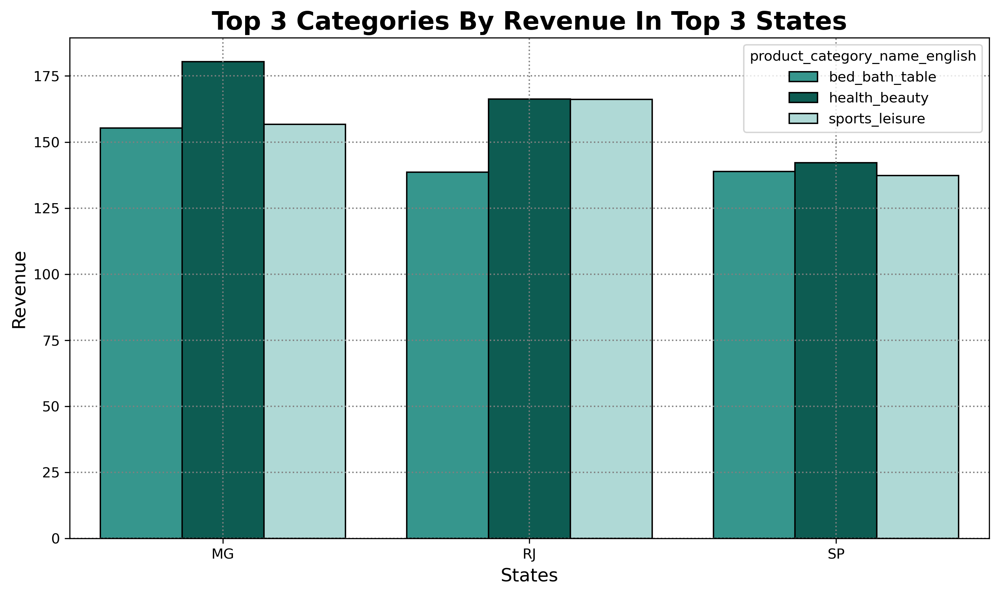
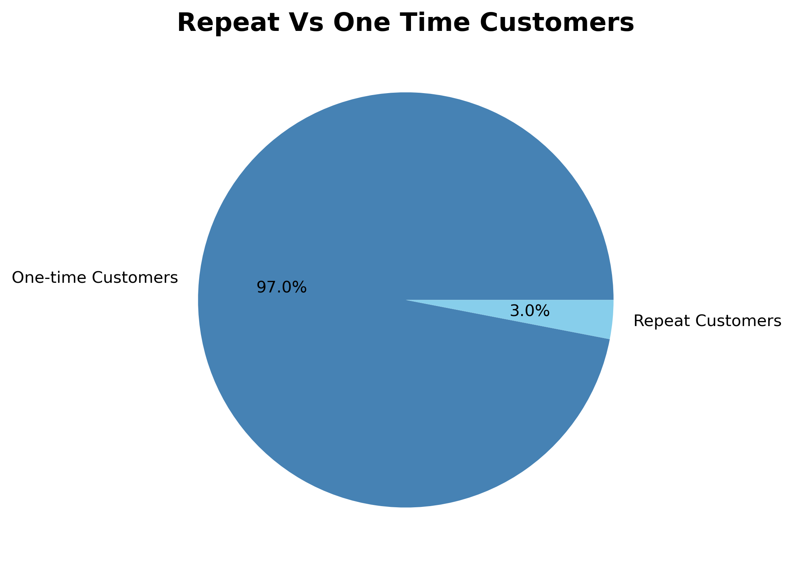
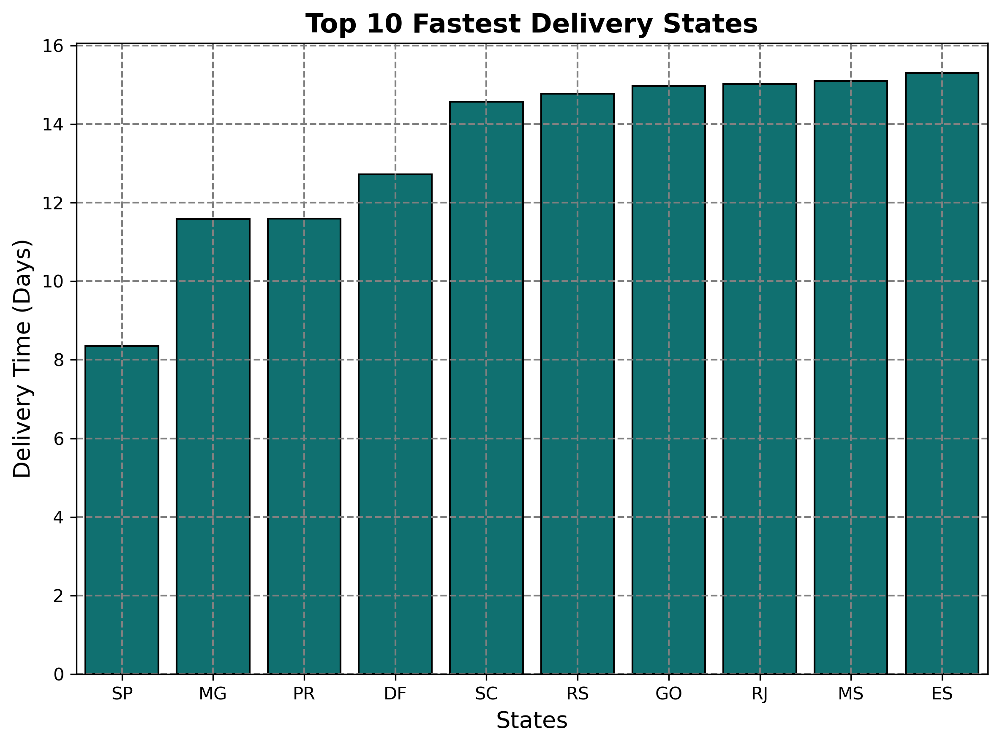
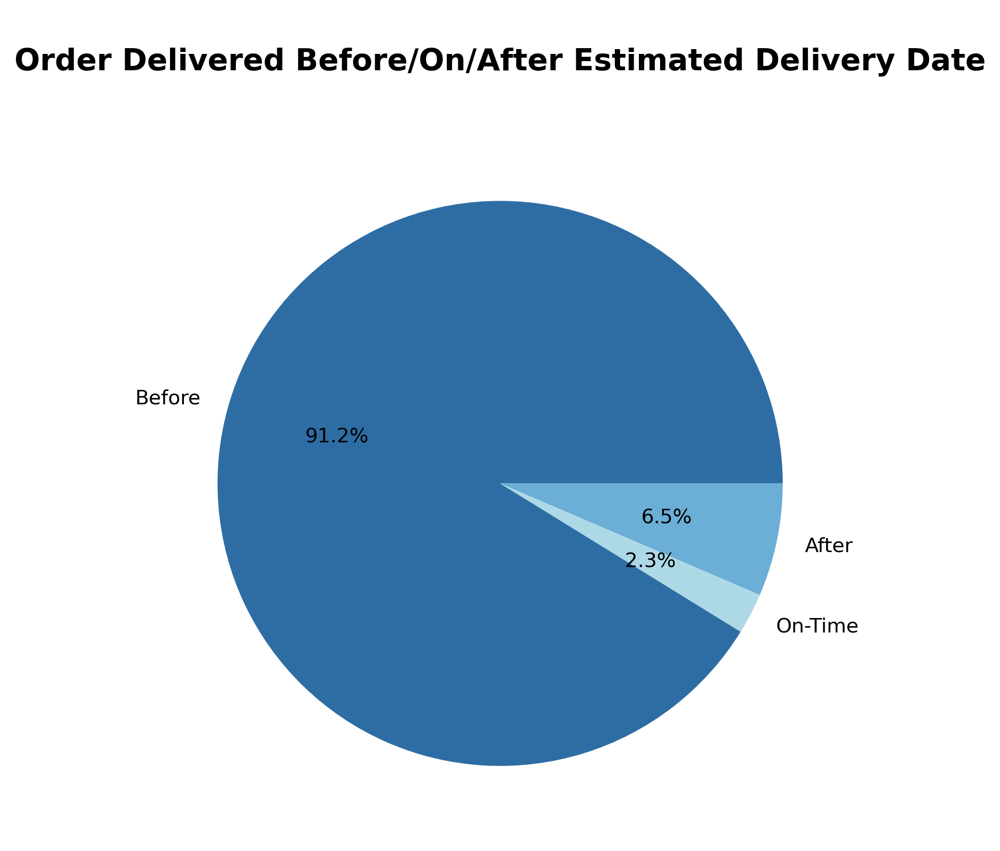

# Analysis & Insights

---
### 1. Monthly Order Trends

**Insights:**
1) The rise in 2016-09 and fall in 2016-12 suggests the platform was not launched properly, that's why orders increased a little bit and then droped to 0.
2) The sharp rise from 0 in 2016-12 to more than 2500 orders in 2017-03 shows the platform was launched properly during this time.
3) 2017-11 got the highest no.of orders placed in the platform. 
4) From 2018-01 to 2018-05, orders were consistently high, nearly 8000 orders per month.
5) The sharp drop from 2018-08 is beacuse of incomplete dataset.

### 2. Peak Ordering Time

**Insights:**
#Days:- 
1) Monday and Tuesday has the highest number of orders - indicating customers like to order after the weekend.
2) No.of orders decreases gradually from Wednesday to Sunday.
3) Saturday and Sunday have less no.of orders than week days - indicating customers are less likely to shop online on weekends.
4) Saturday has the least no.of orders - indicating customers prefer leisure activities over online shopping in the weekends.

#Hours:-
1) No.of orders are very low from 2am to 6am beacuse this is the sleep time for most of the people.
2) No.of orders start increasing from 6am.
3) 11am to 4pm is the peak time of ordering.
4) 4pm has the highest no.of orders - indicating people order towards the end of work hours.
5) From 5pm to 7pm, no.of order decreases - showing people wind down after work.
6) From 8pm to 9pm, no.of orders slightly increases - showing people are recharged and are back to online shopping.
7) After 9pm, no.of orders starts decreasing as it is the dinner and bed time for most of the people.

### 3. Top 3 Product Categories By Revenue In Top 3 States 

**Insights:**
1) health_beauty leads revenue in MG (more than 175) and RJ (more than 150) — it is the most purchased and highest earning category in these two states consistently.
2) All 3 categories perform very similarly in SP — SP is so large that revenue is spread evenly across categories.
3) bed_bath_table and sports_leisure are close competitors across all 3 states — neither category has a clear advantage suggesting customers treat them interchangeably.

### 4. Repeat Vs One Time Customers 

**Insights:**
1) About 97% of customers purchased only once, indicating that most users do not return for another purchase.
2) Only 3% of customers are repeat customers, which suggests weak customer retention.
3) Since almost all purchases come from one-time buyers, the business currently relies more on acquiring new customers.
4) The company needs to work on personalized recommendations, discounts for every customer such that they return after one time purchase.

### 5. Top 10 Fastest Delivery States 

**Insights:**
1) None of the states in the top 10 delivers under 8 days — this means even the best performing states do not have 7 days delivery facility that customers increasingly expect from e-commerce platforms.
2) States ranked 7-10 (GO, RJ, MS, ES) all deliver in almost the same time (~15 days) — fixing logistics in one of these states could provide
a blueprint to improve all four together, saving time and cost for the company.
3) With average delivery even in top states exceeding 8 days, customer satisfaction would be low - faster delivery is directly linked to higher review scores.
4) Company needs to set a strict 7-day delivery scheme as a target to grow their business.

### 6. Orders Delivered Before/On/After Estimated Delivery Date

**Insights:**
1) 91.2% of orders are delivered BEFORE the estimated date — this means Company is setting longer estimated dates than needed, a strategy called "under-promise, over-deliver" that keeps customers happy and reduces complaints.
2) Only 6.5% of orders arrive AFTER the estimated date — this represents thousands of orders that likely resulted in negative reviews and customer dissatisfaction.
3) Only 2.3% of orders arrive exactly on the estimated date — this means company is giving customers a much later delivery date than actually needed, so that customers will trust the platform more and know exactly when to expect their order.
4) The Company could actively promote "delivers earlier than expected" as a selling point to attract new customers and retain existing ones.
5) The Company needs to give attention to the 6.5% late delivery rate as even a small percentage of unhappy customers can significantly damage ratings and brand reputation on the platform.
