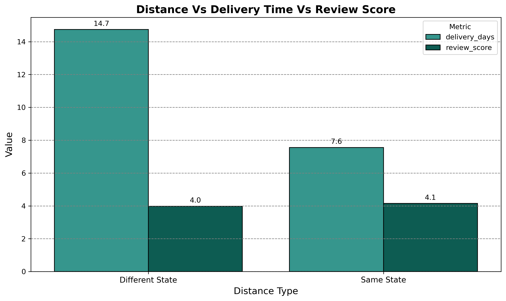
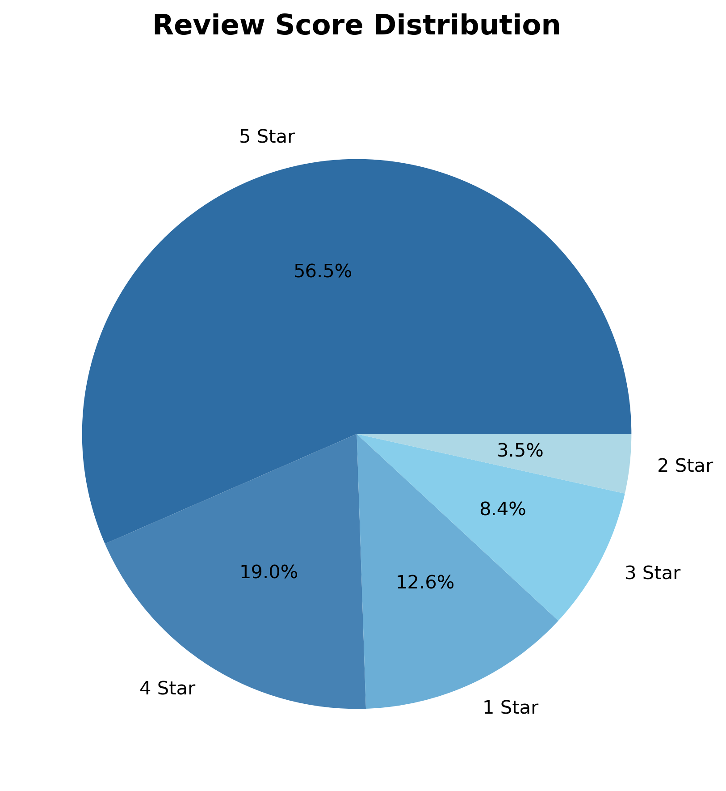
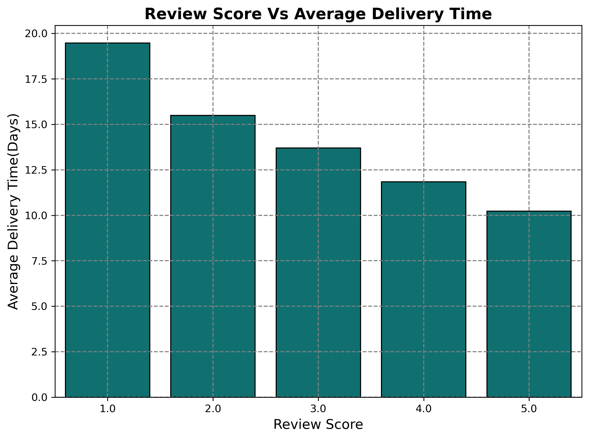
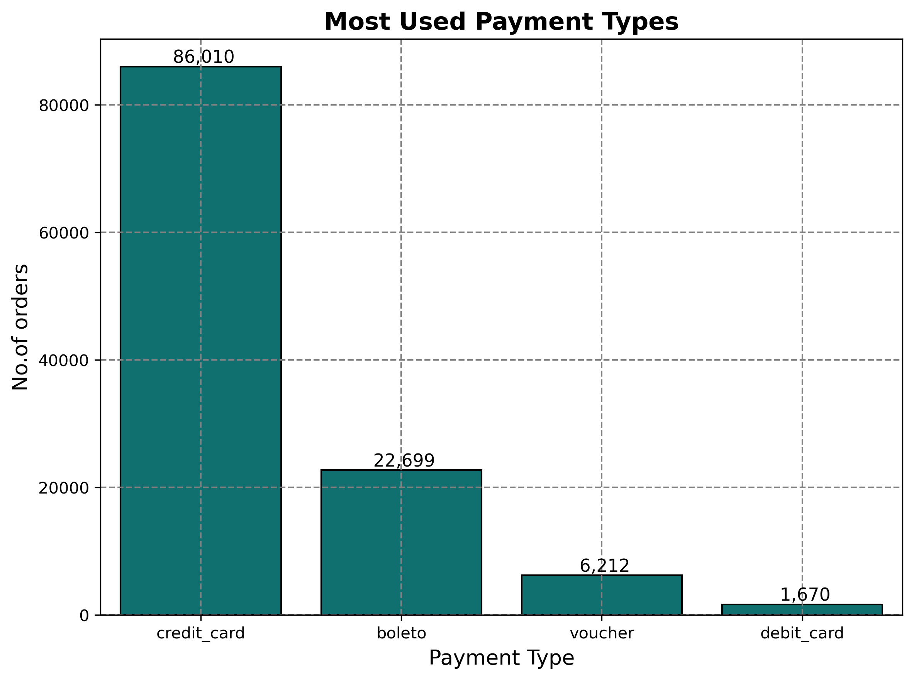
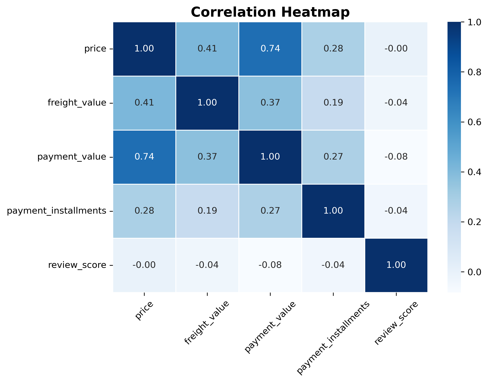
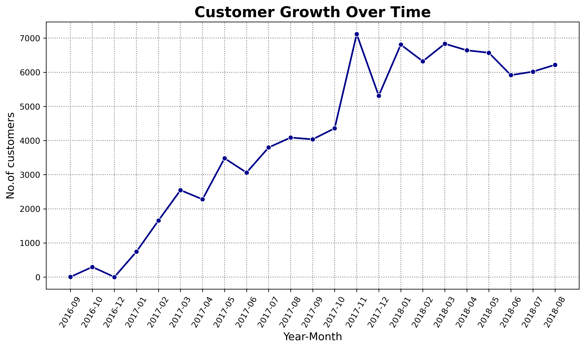

# 🛒 E-Commerce Data Analysis

## 📌 Problem Statement
Olist is the largest department store in Brazilian marketplaces. It connects small businesses from all over Brazil to customers through a single contract. This project analyzes 100k+ orders from 2016 to 2018 to understand customer behavior, delivery performance, payment patterns and key factors affecting customer satisfaction.

---

## 🎯 Objectives
- Identify peak ordering periods and seasonal trends
- Analyze delivery performance across Brazilian states
- Understand payment behavior and preferences of customers
- Find key factors affecting customer review scores
- Provide actionable business recommendations

---

## 📂 Dataset

### Brazilian E-Commerce Public Dataset by Olist
- **Source:** [Kaggle — Olist Dataset](https://www.kaggle.com/datasets/olistbr/brazilian-ecommerce)
- **Period:** 2016 — 2018
- **Size:** 100k+ orders
- **Type:** Real commercial data 

---

## 🛠️ Tools & Technologies
- **Python**
- **Pandas** — data cleaning & manipulation
- **Matplotlib & Seaborn** — data visualization
- **Jupyter Notebook** — development environment

---

## 🔄 Process
1. **Data Collection** — Downloaded Olist dataset from Kaggle
2. **Data Cleaning** — Merged 9 datasets into a single master dataset, handled missing values, removed duplicate rows, removed invalid entries
3. **Feature Engineering** — Created delivery time, distance type, price range columns for deeper analysis
4. **Exploratory Data Analysis** — Identified trends, patterns and relationships across all key metrics
5. **Visualization** — Created 24 charts across key business areas
6. **Business Insights** — Derived actionable recommendations from each analysis

---
   
# Analysis & Insights

---
### 1. Monthly Order Trends

**Insights:**
1) The rise in 2016-09 and fall in 2016-12 suggests the platform was not launched properly, that's why orders increased a little bit and then droped to 0.
2) The sharp rise from 0 in 2016-12 to more than 2500 orders in 2017-03 shows the platform was launched properly during this time.
3) 2017-11 got the highest no.of orders placed in the platform. 
4) From 2018-01 to 2018-05, orders were consistently high, nearly 8000 orders per month.
5) The sharp drop from 2018-08 is beacuse of incomplete dataset.

### 2. Peak Ordering Time

**Insights:**
#Days:- 
1) Monday and Tuesday has the highest number of orders - indicating customers like to order after the weekend.
2) No.of orders decreases gradually from Wednesday to Sunday.
3) Saturday and Sunday have less no.of orders than week days - indicating customers are less likely to shop online on weekends.
4) Saturday has the least no.of orders - indicating customers prefer leisure activities over online shopping in the weekends.

#Hours:-
1) No.of orders are very low from 2am to 6am beacuse this is the sleep time for most of the people.
2) No.of orders start increasing from 6am.
3) 11am to 4pm is the peak time of ordering.
4) 4pm has the highest no.of orders - indicating people order towards the end of work hours.
5) From 5pm to 7pm, no.of order decreases - showing people wind down after work.
6) From 8pm to 9pm, no.of orders slightly increases - showing people are recharged and are back to online shopping.
7) After 9pm, no.of orders starts decreasing as it is the dinner and bed time for most of the people.

### 3. Top 3 Product Categories By Revenue In Top 3 States 

**Insights:**
1) health_beauty leads revenue in MG (more than 175) and RJ (more than 150) — it is the most purchased and highest earning category in these two states consistently.
2) All 3 categories perform very similarly in SP — SP is so large that revenue is spread evenly across categories.
3) bed_bath_table and sports_leisure are close competitors across all 3 states — neither category has a clear advantage suggesting customers treat them interchangeably.

### 4. Repeat Vs One Time Customers 

**Insights:**
1) About 97% of customers purchased only once, indicating that most users do not return for another purchase.
2) Only 3% of customers are repeat customers, which suggests weak customer retention.
3) Since almost all purchases come from one-time buyers, the business currently relies more on acquiring new customers.
4) The company needs to work on personalized recommendations, discounts for every customer such that they return after one time purchase.

### 5. Top 10 Fastest Delivery States 

**Insights:**
1) None of the states in the top 10 delivers under 8 days — this means even the best performing states do not have 7 days delivery facility that customers increasingly expect from e-commerce platforms.
2) States ranked 7-10 (GO, RJ, MS, ES) all deliver in almost the same time (~15 days) — fixing logistics in one of these states could provide
a blueprint to improve all four together, saving time and cost for the company.
3) With average delivery even in top states exceeding 8 days, customer satisfaction would be low - faster delivery is directly linked to higher review scores.
4) Company needs to set a strict 7-day delivery scheme as a target to grow their business.

### 6. Orders Delivered Before/On/After Estimated Delivery Date

**Insights:**
1) 91.2% of orders are delivered BEFORE the estimated date — this means Company is setting longer estimated dates than needed, a strategy called "under-promise, over-deliver" that keeps customers happy and reduces complaints.
2) Only 6.5% of orders arrive AFTER the estimated date — this represents thousands of orders that likely resulted in negative reviews and customer dissatisfaction.
3) Only 2.3% of orders arrive exactly on the estimated date — this means company is giving customers a much later delivery date than actually needed, so that customers will trust the platform more and know exactly when to expect their order.
4) The Company could actively promote "delivers earlier than expected" as a selling point to attract new customers and retain existing ones.
5) The Company needs to give attention to the 6.5% late delivery rate as even a small percentage of unhappy customers can significantly damage ratings and brand reputation on the platform.

### 7.  Distance Vs Delivery Time Vs Review Score 

**Insights:**
1) Different state orders take 14.7 days while same state orders take only 7.5 days — orders crossing state boundaries take double the time to deliver compared to local orders.
2) Review score drops from 4.1 (same state) to 4.0 (different state) — surprisingly small difference, suggesting customers are somewhat   understanding of longer delivery times for distant orders.
3) Despite 2x longer delivery time, review score only drops by 0.1  — this means distance alone does not drastically hurt satisfaction, company's estimation strategy is working well for cross-state orders.

### 7.  Distribution of Review Score 

**Insights:**   
1) 56.5% of customers gave 5 stars — more than half of all customers are highly satisfied, which is a strong indicator that the company's overall product and delivery experience is positive.
2) Combined 4 and 5 star reviews make up 75.5% — this means larger portion of the customers are happy with their experience.
3) 12.6% of customers gave 1 star - which is concerning because a good portion of customers had bad experience and are likely to give the lowest review score or return the product.
4) 2 and 3 star reviews together make up 11.9% — customers are disappointed with the product or delivery.
5) The gap between 5 star (56.5%) and 1 star (12.6%) is large but the 1 star percentage is still too high — the company should investigate what drives 1 star reviews (late delivery, wrong product,poor quality) and target to reduce it.

### 8.  Review Score Vs Average Delivery Time 

**Insights:** 
1) As delivery time decreases, review score increases consistently. This is the strongest evidence that delivery time is the biggest driver of customer satisfaction.
2) 1 star reviews have nearly 20 days of delivery time while 5 star reviews have nearly 11 days - 9 days difference between 1 star and 5 star eliveries shows that cutting delivery time by nearly 9 days would potentially increase the review score.
3) 4 and 5 star reviews both fall under 12.5 days — this confirms that delivering within 12 days is the threshold for earning a positive review from customers.

### 9.  Most Used Payment Types 

**Insights:** 
1) Credit card dominates with 86,010 orders — customers strongly prefer paying in installments.
2) Boleto is second with 22,699 orders  — this is a Brazil-specific payment method showing that a significant portion of customers don't have or trust credit cards for online shopping.
3) Debit card is the least used with only 1,670 orders — customers avoid debit cards for online purchases, likely due to security concerns or preference for installment options.
4) The low voucher usage (6,212 orders) suggests the company's discount and promotional voucher strategy is not reaching enough customers — a stronger voucher campaign could boost sales significantly.
5) The company should start offering better EMI options, zero interest plans, or credit card exclusive deals as credit card is the backbone of payment system for the company.

### 10.  Correlation Heatmap

**Insights:** 
 1) price vs payment_value (0.74) — strongest correlation — higher priced products directly lead to higher total payment 
 confirming price is the main driver of revenue
 2) price vs freight_value (0.41) — moderate correlation — expensive products tend to be heavier, leading to higher
 shipping costs for customers
3) price vs payment_installments (0.28) — weak positive — not a strong relationship 
4) review_score has negative correlation with all variables(-0.00, -0.04, -0.08, -0.04) — price, freight, payment value
and installments cannot predict review score
5) freight_value vs payment_installments (0.19) — very weak — high shipping cost does not significantly push customers
to pay in installments

### 11.  Customer Growth Over Time 

**Insights:** 
1) Strong overall growth from Dec 2016 to Nov 2017 — new customer grew from nearly 0 to 7000+, showing the company expanded very rapidly in its early stages.
2) Nov 2017 has the highest no.of customers — this is likely to coincide with Black Friday 2017, confirming that seasonal sales events attracts more no.of customers.
3) 2018 shows a stable no.of customers per month — growth has stabilized meaning the company is no longer in its hyper growth phase and needs new strategies for acquiring new customers.
4) The data ends at Aug 2018 with more than 6000 customers — the slight decline from the 2018 peak suggests growth is starting to slow down and acquiring new customers is getting harder and more expensive.

---

## ✅ Conclusion
- **Delivery time** is the single strongest driver of customer satisfaction on Olist
- **91.2%** orders delivered before estimated date — customers receive their orders earlier than expected which makes them      happy and builds trust in the platform
- **12.6%** of 1 star reviews need urgent attention as they directly damage platform reputation
- **Only 3%** repeat customers — improving retention is the biggest untapped business opportunity
- **Credit card EMI** options are critical as 74% customers prefer installment payments
- **SP delivers in 8.4 days** — regional warehouses in northern states could standardize delivery nationally

---

## ⚠️ Limitations
- Outlier removal is not applied due to wide price range across diverse product categories on the platform
- Dataset covers only 2016-2018 — trends may have changed
- Distance analysis is based on state level and not exact coordinates are used

---

