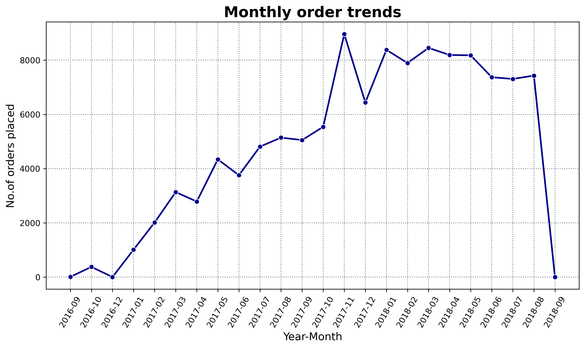
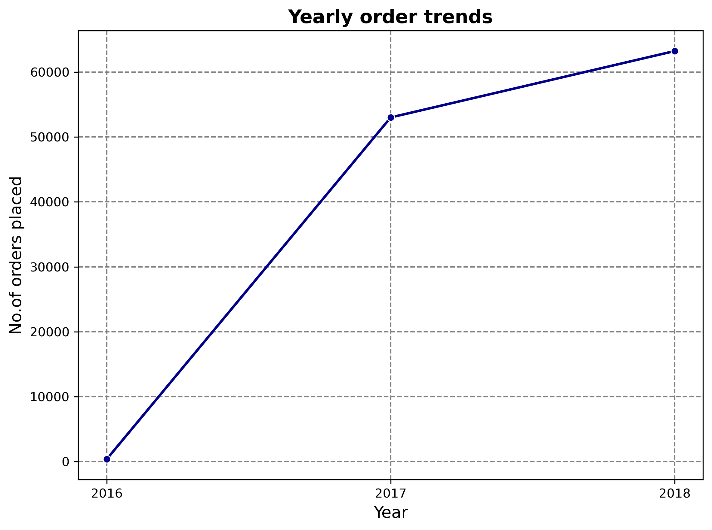
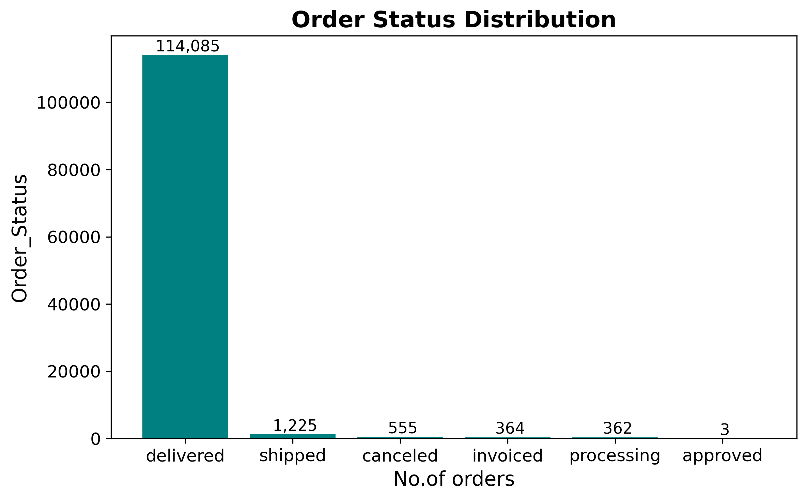
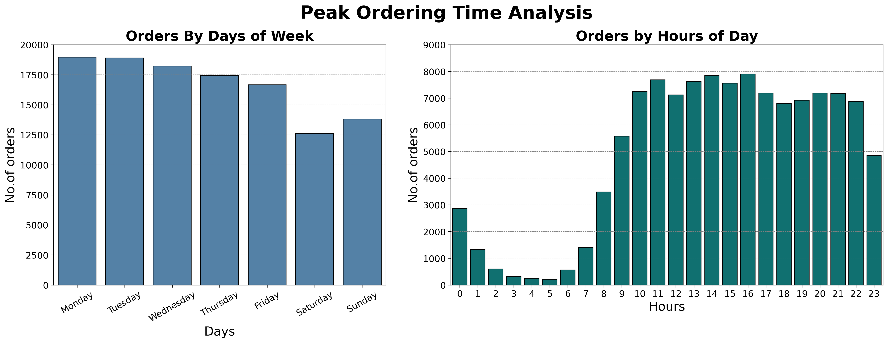
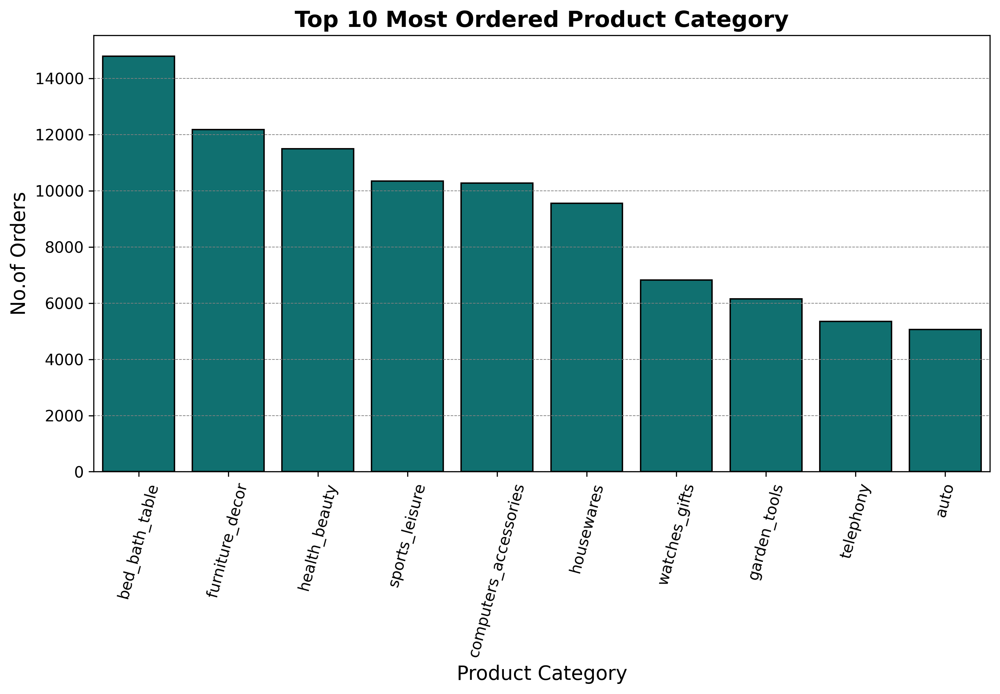
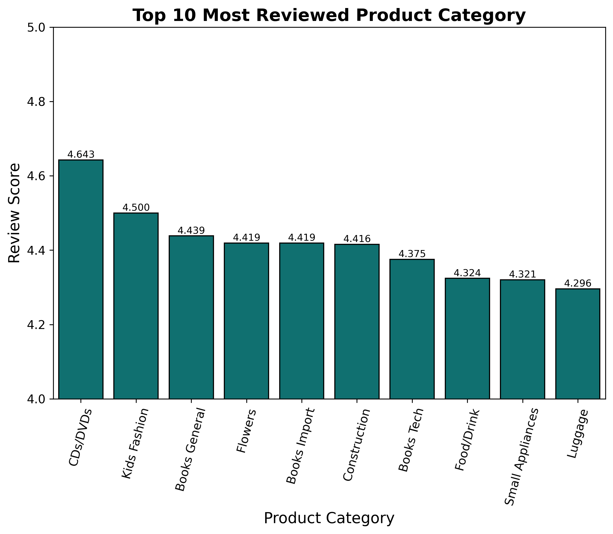
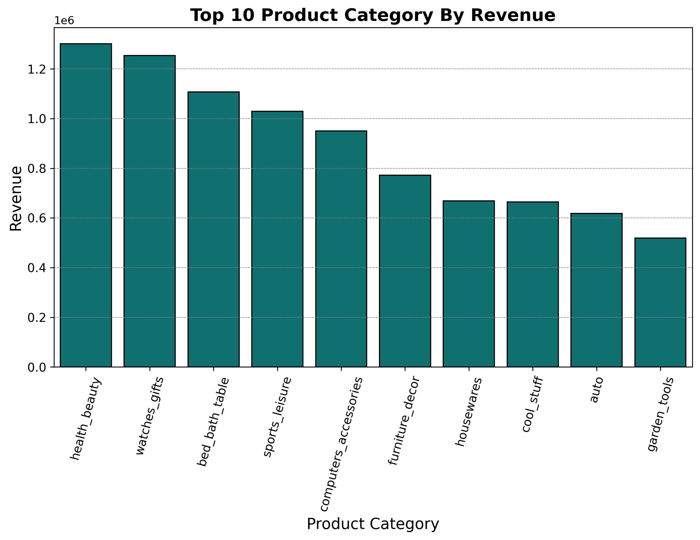
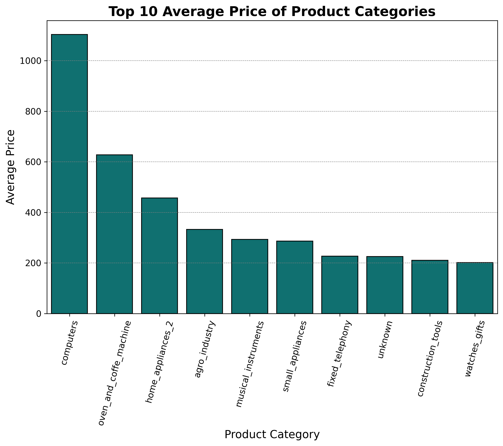

# Analysis & Insights

---
## Order Analysis
### 1. Monthly Order Trends

**Insights:**
1) The rise in 2016-09 and fall in 2016-12 suggests the platform was not launched properly, that's why orders increased a little bit and then droped to 0.
2) The sharp rise from 0 in 2016-12 to more than 2500 orders in 2017-03 shows the platform was launched properly during this time.
3) 2017-11 got the highest no.of orders placed in the platform. 
4) From 2018-01 to 2018-05, orders were consistently high, nearly 8000 orders per month.
5) The sharp drop from 2018-08 is beacuse of incomplete dataset.

### 2. Yearly Order Trends

**Insights:**
1) The platform started in 2016. So, orders were relatively low.
2) From 2016 to 2017, massive growth occured and no.of orders were more than 50,000.
3) From 2017 to 2018, no.of orders kept on increasing - showing expansion in business.

 ### 3. Order Status Distribution

**Insights:**
1) 114,085 orders are delivered - showing the platform has high delivery success rate.
2) 1,225 orders were in transit when the data was collected.
3) 555 orders are canceled - showing very low cancelation rate and high customer satisfaction.
4) 364 invoiced orders and 362 processing orders were in pre-shipment stages when the data was collected.
  

### 4. Peak Ordering Time

**Insights:**
#Days:- 
1) Monday and Tuesday has the highest number of orders - indicating customers like to order after the weekend.
2) No.of orders decreases gradually from Wednesday to Sunday.
3) Saturday and Sunday have less no.of orders than week days - indicating customers are less likely to shop online on weekends.
4) Saturday has the least no.of orders - indicating customers prefer leisure activities over online shopping in the weekends.

#Hours:-
1) No.of orders are very low from 2am to 6am beacuse this is the sleep time for most of the people.
2) No.of orders start increasing from 6am.
3) 11am to 4pm is the peak time of ordering.
4) 4pm has the highest no.of orders - indicating people order towards the end of work hours.
5) From 5pm to 7pm, no.of order decreases - showing people wind down after work.
6) From 8pm to 9pm, no.of orders slightly increases - showing people are recharged and are back to online shopping.
7) After 9pm, no.of orders starts decreasing as it is the dinner and bed time for most of the people.

## Product Analysis
### 1. Top 10 Product Category

**Insights:**   
1) bed_bath_table and furniture_decor have the highest and second highest no.of orders respectively - indicating customers frequently purchase home essentials online.
2) health_beauty has the third highest no.of orders - indicating growing trend of online beauty shopping.
3) computers_accessories shows strong demand for tech products.
4) The top 5 categories all have 10,000+ orders - showing consistent demand.
5) Home & lifestyle categories (bed_bath_table, health_beauty, furniture_decor) dominate - suggesting customers primarily use this platform for household and personal care needs.

### 2. Top 10 Most Reviewed Product Category

**Insights:**  
1) CDs/DVDs has the highest review score - indicating customers are very satisfied with media products.
2) Kids Fashion is second - showing high satisfaction with children's clothing.
3) All top 10 categories have scores above 4.2 - indicating overall high customer satisfaction across the platform.
4) The difference between highest (4.643) and lowest (4.296) is only 0.347 - showing consistent quality across categories.
5) Books (General, Import, Technical) appear 3 times in top 10 - suggesting customers are very satisfied with book purchases.

### 3. Top 10 Product Categories By Revenue

**Insights:** 
1) health_beauty generates the highest revenue, despite being 3rd in top 10 orders — indicating higher priced products.
2) watches_gifts is 2nd in revenue, but was 7th in top 10 orders - confirming it has high priced items.
3) bed_bath_table is 3rd in revenue and also 1st in top 10 orders - showing both high sales and decent pricing.
4) cool_stuff appears in revenue top 10 but was not in top 10 orders - suggesting it has fewer but expensive orders.

 ### 4. Top 10 Average Price Of Product Categories

**Insights:**   
1) Computers has the highest average price — indicating customers spend heavily on tech products.
2) Oven_and_coffee_machine is in 2nd position — home appliances are premium priced.
3) 'unknown' category suggests some high-priced products were not properly categorized — data quality issue.
4) Computers and home appliances are the most expensive categories. Although they don't appear in the top 10 by orders,their high price makes them valuable for revenue. These are good targets for premium marketing campaigns.
